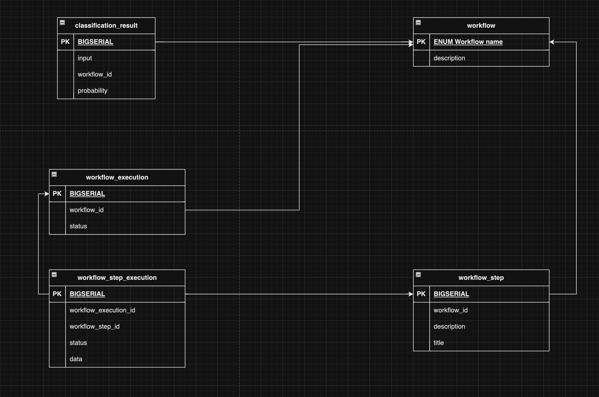

# [Flowify.com](http://flowify-ai.s3-website-us-east-1.amazonaws.com)

Kaseya Hackathon: 8/9/2023-9/9/2023

# Maintainers

- **admin/client:** [Anton Bachykin](https://github.com/DenyingTheTruth)
- **admin/server:** [Ruslan Zianevich](https://github.com/ruslanzianevich)
- **worker-cli**: [Andrei Kozel](https://github.com/andrey-kozel)
- **core/server/ai**: [Nikita Gurets](https://github.com/StepanBURNdera)
- **core/client**: [Anton Bachykin](https://github.com/DenyingTheTruth)
- **core/server**: [Alina Glumova](https://github.com/aglumova)
- **landing**: [Anton Bachykin](https://github.com/DenyingTheTruth)

Open to [CONTRIBUTING](.github/CONTRIBUTING.md)

# Modules

## Core

- [Worker CLI](worker-cli/README.md)
- [Communication Hub](core/server/README.md)
- [Communication Hub AI](core/server/src/ai/README.md)
- [Flowify ChatBot](core/client/README.md)

#### Client Chat Bot UI


Video

[](docs/videos/client_site_flow.mp4)

## Administration Panel

- [Server](admin/server/README.md)
- [Client](admin/client/README.md)

#### Admin Client UI


Video

[](docs/videos/admin_site_flow.mp4)

## Database Migration Tool

- [DB Migration](db/README.md)

# High Level architecture


# DB Structure



# Billing Model

[Billing Model](BILLING_MODEL.md)

### Migration

First run need to run:

```bash
${AI_HOME}/scripts/run-service-local --init-dbs
```

If you want to run just a migration, use:
```bash
${AI_HOME}/scripts/run-service-local --run-db-migrations
```

## Environment Variables

<table>
    <thead>
        <tr>
            <th colspan=4><h1>Environment Variables</h1></th>
        </tr>
        <tr>
            <th>Variable</th>
            <th>Description</th>
            <th>Type</th>
            <th>Default</th>
        </tr>
    </thead>
    <tbody>
        <tr>
            <td>AI_HOME</td>
            <td>Root path of project</td>
            <td>String</td>
            <td> - </td>
        </tr>
    </tbody>
</table>

